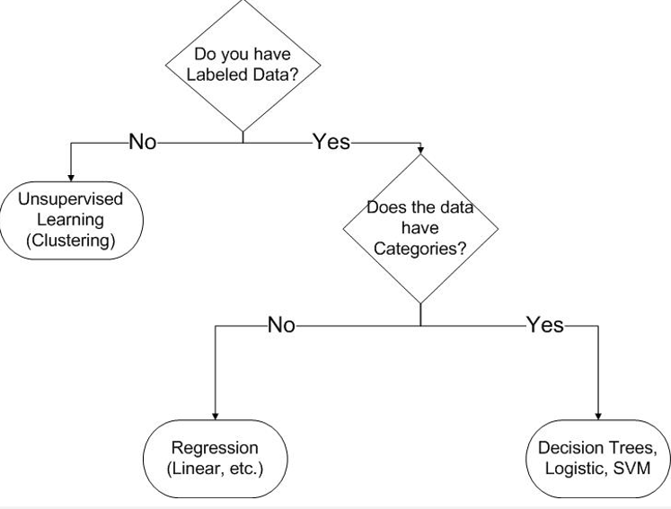

> ## Databases
* Database is just about anything you put into a file
* It has fields (columns)
* Target - column you are trying to learn something from it
* Records (rows) - information about those columns

**Data warehouse** - 
Database that store historical data.

**Database Key** - Field with a unique value
* Makesit easy to find data
* This way you know you found the "right" record
* numbers, names and salary for exemple are fields that can be keys

**Relationships** - When the information between tables is linked, it is called a **relationship**. Relationships link data from individual tables to increase the usefulness of the database.


There are 3 types of relationships:
1. **One-to-One** - Only one matchin record between two tables. This relationship is the least common because it is not a very efficient use of tables.
2. **One-to-Many** - Most common type. One record in table *A* links to multiple records in Table *B*.
3. **Many-to-Many** - Multiple records in Table *A* are linked to multiple records in table *B*.


**Primary Keys (PK) and Foregin Keys (FK)** - When tables relate, the primary key of one table becomes the foreign key of the other.

Here, The **Employee ID** is the PK and it shows in the Orders table also, as a FK.

**Employees : Table**
Employee ID | Last Name | First Name
---|---|---
1 | Makdasy | Ofry

**Orders : Table**
Order ID | Customer ID | Employee ID
--- | --- | ---
10022 | LAMAI | 1

**Function of the Junction Table** - A junction table is used with many to many relationships to join primary key fields of multiple tables.

### Software for Database Management:

* Access, Oracle, Sybase, SAP.
* SQL - Structured Query Language.

<hr>

> ## SQL

SQL keyword | Description
--|--
SELECT | fetch information from one table or more
FROM | define the table to select the data from
WHERE | define the query
ORDER BY | the terms to order the data by
INSERT | inserting data to table
DELETE | delete data from table

Boolean Logic
Operator | Description
---|---
= | Equal
<> | Not equal
\> | Greater then
< | Less then
\>= | Greater than or equal
<= | Less than or equal
AND | Logical and
OR | Logical or
LIKE | Search for a pattern

**Basic SELECT query examples**
```SQL
SELECT * FROM tableName
```
(the star * means all)

```SQL
SELECT aurhorID, lastName FROM Authors
```
```SQL
SELECT * FROM Authors WHERE lastName='Deitel'
```
```SQL
SELECT * FROM Authors WHERE lastName<>'Deitel'
```
```SQL
SELECT * FROM Authors WHERE authorID > 9
```
```SQL
SELECT * FROM Authors WHERE authorID>2 AND authorID<5
```

Order results in Ascending (ASC) or Descending (DESC) order
```SQL
SELECT columnName1 , columnName2 From tableName ORDER BY column ASC
```

**Basic INSERT command examples**
```sql
INSERT INTO tableName (columnName1, columnName2 ... , columnNameN) VALUES (value1, value2 ... , valueN)

INSERT INTO Authors VALUES (14, 'Shwartz')
```

**Basic DELETE command examples**
```sql
DELETE * FROM tableName
```
```sql
DELETE * FROM Authors WHERE LastName='Deital'
```
**Use of LIKE command**
```sql
SELECT * FROM tableName WHERE columnName LIKE 'S%'
```
finds records that start with 'S'
```sql
SELECT * FROM tableName WHERE columnName LIKE '%S%'
```
finds records that include 'S'

<hr>

[link to ex.1](../../ex/ex1/ex1.md) about SQL basics


> ## Data Mining
Data mining is not Database processing. in Database processin you know exactly what you are looking for.

Data mining does not know in advance what to look for and has no structured language.
* Which person sold the most products? (SQL)
* Which items were sold the most? (SQL)
* Will product X be profitable? (Classification)
* How much profit will product X generate? (Regression, forecasting)
* Which products are usually sold together? (clustering / associative rules)
* Which features in product X led to a profit? (feature analysis)

<hr>

> ## Decision Trees and Categorical Learning





**Decision Trees Algorithm Overview** - 
1. check for base cases and return the classification (a leaf)
2. from all attributes find the attricute with the best splitting criterion (a_best)
3. create a decision node that splits on a_best
4. recurse on the sublist by splitting on a_best, and add those nodes aschildren of nodes

### **Entropy** - 
* Low Entropy is better
* Entropy of 1 happens when the groups are fully mixed

[link to ex.2](../../ex/ex2/ex2.md) about entropy

[**Information Gain**](./Golf.xlsx) - how much we learned from an attribute. The attribute that with the most IG is the one you shuold split by it

**Gain Ratio** - a modification of the information gain tha reduce its bias on high-branch attributes. it should be large when data is evenly spread

**CART - GINI Index** - 

[**RandomForest**](https://en.wikipedia.org/wiki/Random_forest) - trains on diffrent parts of the data to avoid overfitting in deep trees

### Bootstraping - Create Similar Data
bootstrapping is a statistical procedure that resamples a signle dataset to create many simulated samples. (changing the data to a not real but similar data)


> ## Evaluating Categorical Learning

* Recall
* Precision
* Accuracy

**10-fold cross-validation** -
1. divide the data into 10 (k) parts.
2. Treat the 1st tenth of the data as the test dataset. crete a model according to the train dataset
3. Apply the model to the test data 
4. Repeat this procedure for all 10 tenths of the data
5. Calculate statistics of model accuracy and fit 


[link to ex.3](../../ex/ex2/ex2.md) about basic python skils


