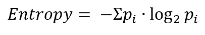
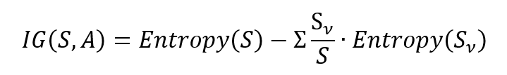

> # Ex 2 - Entropy

*Entropy* is the average level of uncertainty inherent in the variable's possible outcomes. It value ranges from 0 to 1, lower values means less uncertainty.

### Information Gain
Information gain tells up how imprtant a given attribute of the feature vector is.

### IF 

***

### Gain Ratio

***

[Entropy Claculation Python Script](entropy.py)

